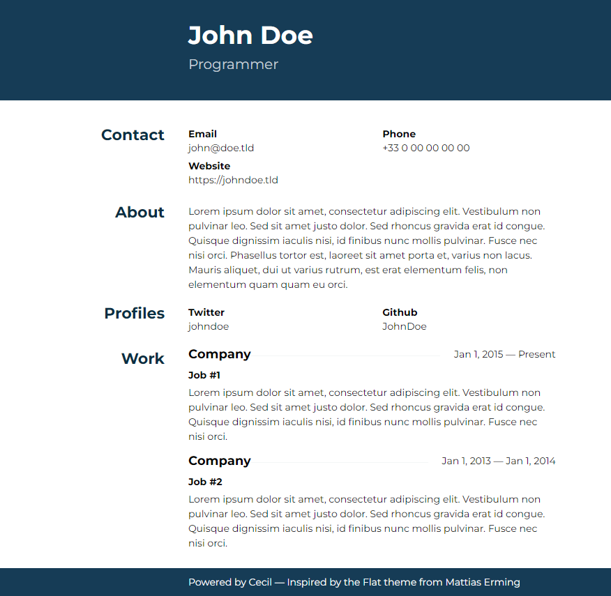

# Resume theme

The _Resume_ theme for [Cecil](https://cecil.app).



## Installation

```bash
composer require cecil/theme-resume
```

> Or [download the latest archive](https://github.com/Cecilapp/theme-resume/releases/latest/) and uncompress its content in `themes/resume`.

## Usage

Add `resume` in the `theme` section of your `config.yml`:

```yaml
theme:
  - resume
```

Configuration:

```yaml
resume:
  contact:
    email: john@doe.tld
    phone: +33 0 00 00 00 00
    website: https://johndoe.tld
  profiles:
    - network: Github
      username: JohnDoe
      url: https://github.com/JohnDoe
```

Creates work experiences pages in `pages/works`:

```yaml
---
company: Company
position: "Job #1"
url: https://company.tld
start: 2015-01-01
---
Job description
```

### Internationalization

This theme support [localization](https://cecil.app/documentation/templates/#localization), and provides french (`fr_FR`) translation (see `translations/messages.fr_FR.po`).

Configuration:

```yaml
languages:
  - code: fr
    locale: fr_FR
```

## License

 _Resume_ is a free software distributed under the terms of the MIT license.

© [Arnaud Ligny](https://arnaudligny.fr)
