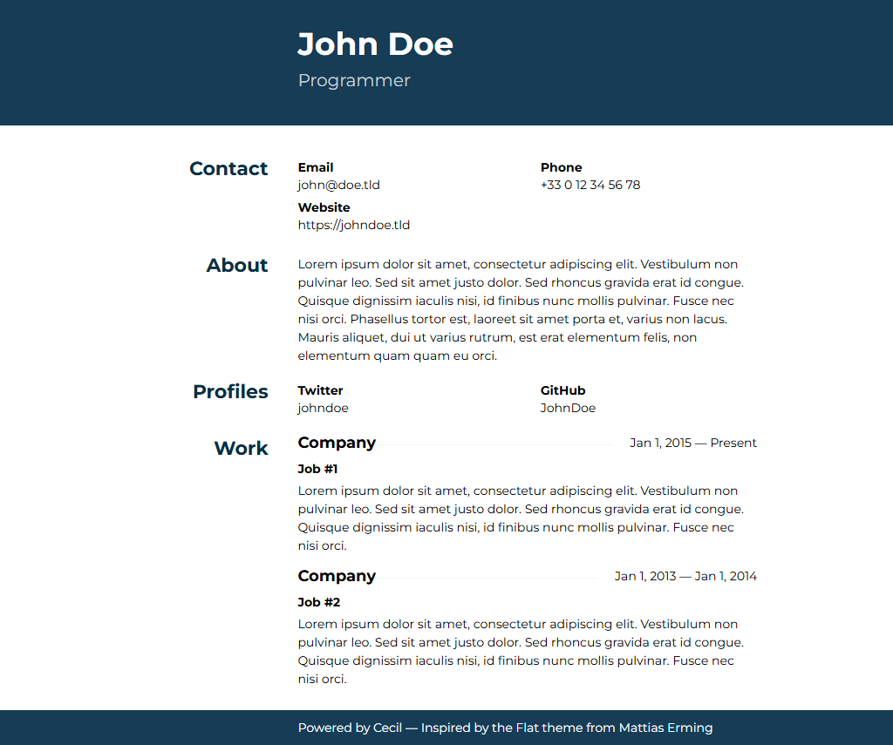

# Resume theme

_Resume_ is a theme for creating professional resumes with [Cecil](https://cecil.app).



## Features

- One page resume: contact, about, profiles and work experiences
- Work experiences managed as pages, sorted by start date
- Empty sections are hidden
- Localization ready (english and french)

## Installation

```bash
composer require cecil/theme-resume
```

> Or [download the latest archive](https://github.com/Cecilapp/theme-resume/releases/latest/) and uncompress its content in `themes/resume`.

## Usage

Add `resume` in the `theme` section of your configuration file:

```yaml
theme:
  - resume
```

The homepage (`pages/index.md`) content is displayed in the _About_ section.

### Configuration

```yaml
title: John Doe
baseline: Programmer # optional
description: John Doe, Full Stack Developer Ninja Expert.
resume:
  contact: # each entry is optional
    email: john@doe.tld
    phone: +33 0 00 00 00 00
    website: https://johndoe.tld
  profiles:
    - network: GitHub
      username: JohnDoe # optional
      url: https://github.com/JohnDoe # optional
```

### Work experiences

Create _work experiences_ pages in `pages/works/`:

```yaml
---
company: Company # optional, fallback to title
position: "Job #1" # optional
url: https://company.tld # optional
start: 2015-01-01 # required
end: 2016-01-01 # optional, "Present" if not set
---
Job description.
```

See the [`demo`](demo/) folder for a complete example.

### Internationalization

This theme support [localization](https://cecil.app/documentation/templates/#localization), and provides french (`fr_FR`) translation (see `translations/messages.fr_FR.po`).

Configuration:

```yaml
languages:
  - code: fr
    locale: fr_FR
```

## License

_Resume_ is a free software distributed under the terms of the MIT license.

© [Arnaud Ligny](https://arnaudligny.fr)
